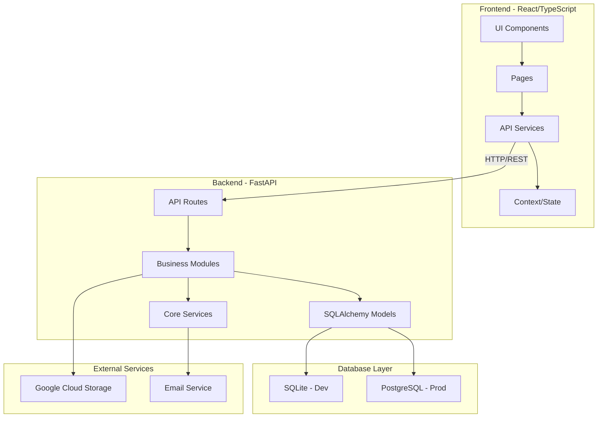
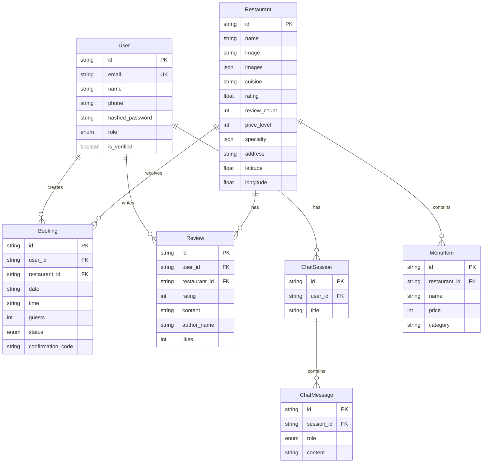
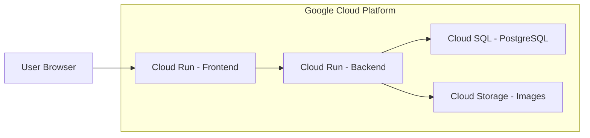

# 📊 Báo Cáo Phân Tích Kiến Trúc - Smart Travel System

## 1. Tổng Quan Dự Án

**Smart Travel System** là một ứng dụng web đặt bàn nhà hàng và khám phá ẩm thực, được xây dựng với kiến trúc **Client-Server** hiện đại.

### Tech Stack

| Layer | Technology |
|-------|------------|
| Frontend | React 18 + TypeScript + Vite |
| UI Framework | Tailwind CSS + Radix UI + shadcn/ui |
| Backend | Python FastAPI |
| Database | SQLite (dev) / PostgreSQL Cloud SQL (prod) |
| ORM | SQLAlchemy 2.0 (Async) |
| Authentication | JWT (python-jose) + bcrypt |
| Deployment | Google Cloud Run |

---

## 2. Kiến Trúc Tổng Thể



---

## 3. Phân Tích Frontend

### 3.1 Cấu Trúc Thư Mục

```
New_Frontend/src/
├── components/          # Reusable UI components
│   ├── ui/             # shadcn/ui components
│   ├── common/         # Shared components
│   └── figma/          # Design-specific components
├── pages/              # Page components
│   ├── Home/
│   ├── Restaurants/
│   ├── Bookings/
│   ├── Chatbot/
│   ├── Reviews/
│   └── ...
├── services/           # API communication
│   ├── api.ts          # Restaurant/Review APIs
│   └── auth.ts         # Authentication APIs
├── context/            # React Context
│   └── SidebarContext.tsx
└── App.tsx             # Main application
```

### 3.2 Điểm Mạnh ✅

1. **Modern Stack**: React 18 + TypeScript + Vite cho performance tốt
2. **Component Library**: Sử dụng Radix UI + shadcn/ui - accessible và customizable
3. **Type Safety**: TypeScript với interfaces rõ ràng cho API responses
4. **Responsive Design**: Tailwind CSS với mobile-first approach
5. **Code Organization**: Tách biệt pages, components, services rõ ràng

### 3.3 Điểm Cần Cải Thiện ⚠️

1. **State Management**: 
   - Chỉ sử dụng React Context đơn giản
   - Không có global state management (Redux, Zustand, Jotai)
   - Auth state được lưu trong localStorage và component state

2. **API Layer**:
   - Không có request caching (React Query, SWR)
   - Không có retry logic cho failed requests
   - Error handling cơ bản

3. **Code Duplication**:
   - API_BASE_URL được định nghĩa ở nhiều file
   - Một số logic có thể được abstract thành custom hooks

4. **Testing**:
   - Không thấy test files trong frontend

---

## 4. Phân Tích Backend

### 4.1 Cấu Trúc Modules

```
backend/app/
├── core/               # Core services
│   ├── config.py       # Settings (pydantic-settings)
│   ├── database.py     # SQLAlchemy async setup
│   └── security.py     # JWT + Password hashing
├── modules/            # Feature modules
│   ├── auth/           # Authentication
│   ├── users/          # User management
│   ├── restaurants/    # Restaurant CRUD
│   ├── bookings/       # Booking management
│   ├── reviews/        # Review system
│   ├── chat/           # Chatbot
│   └── contact/        # Contact form
└── shared/             # Shared utilities
    ├── schemas.py      # Base response schemas
    └── email_service.py
```

### 4.2 Database Schema



### 4.3 Điểm Mạnh ✅

1. **Async Architecture**: SQLAlchemy 2.0 async cho high concurrency
2. **Modular Design**: Tách biệt modules theo domain
3. **Standardized Responses**: Consistent API response format
4. **Security**: 
   - JWT với access/refresh tokens
   - OTP-based registration và password reset
   - Rate limiting cho OTP
5. **Cloud-Ready**: Hỗ trợ Cloud SQL PostgreSQL
6. **Auto-Seeding**: Tự động seed data khi database trống

### 4.4 Điểm Cần Cải Thiện ⚠️

1. **Validation**:
   - Một số routes thiếu input validation chi tiết
   - Không có request rate limiting global

2. **Error Handling**:
   - Không có global exception handler
   - Error codes không được document rõ ràng

3. **Logging**:
   - Chỉ có print statements, không có structured logging

4. **Testing**:
   - Có pytest trong requirements nhưng không thấy test files

5. **Documentation**:
   - API docs tự động từ FastAPI nhưng thiếu examples

6. **Admin Endpoints**:
   - Các endpoint `/api/admin/*` không có authentication

---

## 5. API Design Analysis

### 5.1 Endpoints Overview

| Module | Endpoints | Auth Required |
|--------|-----------|---------------|
| Auth | `/api/auth/*` | Partial |
| Users | `/api/users/*` | Yes |
| Restaurants | `/api/restaurants/*` | No |
| Bookings | `/api/bookings/*` | Yes |
| Reviews | `/api/reviews/*` | Partial |
| Chat | `/api/chat/*` | Partial |
| Contact | `/api/contact/*` | No |

### 5.2 Response Format

```json
{
  "success": true,
  "data": { ... },
  "message": "Success message",
  "error": null,
  "meta": {
    "timestamp": "2025-12-11T07:00:00Z",
    "pagination": {
      "page": 1,
      "limit": 10,
      "total": 100,
      "total_pages": 10,
      "has_next": true,
      "has_prev": false
    }
  }
}
```

---

## 6. Security Analysis

### 6.1 Implemented ✅

- JWT authentication với access/refresh tokens
- Password hashing với bcrypt
- OTP verification cho registration
- CORS configuration
- Input validation với Pydantic

### 6.2 Missing/Concerns ⚠️

- Admin endpoints không có authentication
- SECRET_KEY hardcoded trong config (nên dùng env var)
- Không có HTTPS enforcement
- Không có SQL injection protection documentation
- Không có XSS protection headers

---

## 7. Deployment Architecture



---

## 8. Đánh Giá Tổng Thể

### 8.1 Điểm Số

| Tiêu Chí | Điểm (1-10) | Ghi Chú |
|----------|-------------|---------|
| Code Organization | 8 | Cấu trúc rõ ràng, modular |
| Type Safety | 7 | TypeScript + Pydantic |
| Security | 6 | Cơ bản tốt, thiếu một số best practices |
| Performance | 7 | Async backend, nhưng thiếu caching |
| Scalability | 7 | Cloud-ready, nhưng cần optimization |
| Maintainability | 7 | Tốt nhưng thiếu tests |
| Documentation | 5 | Cần cải thiện |

**Tổng điểm: 6.7/10**

### 8.2 Recommendations

#### High Priority 🔴

1. **Add Authentication to Admin Endpoints**
2. **Implement Global Error Handler**
3. **Add Unit/Integration Tests**
4. **Move Secrets to Environment Variables**

#### Medium Priority 🟡

1. **Add React Query/SWR for API Caching**
2. **Implement Structured Logging**
3. **Add Rate Limiting**
4. **Create API Documentation**

#### Low Priority 🟢

1. **Add Global State Management**
2. **Implement WebSocket for Real-time Chat**
3. **Add Performance Monitoring**
4. **Create CI/CD Pipeline**

---

## 9. Kết Luận

Smart Travel System là một dự án được xây dựng với công nghệ hiện đại và kiến trúc tương đối tốt. Dự án có nền tảng vững chắc với:

- **Frontend**: React + TypeScript + Tailwind CSS
- **Backend**: FastAPI + SQLAlchemy Async
- **Database**: SQLite/PostgreSQL với ORM

Tuy nhiên, để production-ready, cần:
1. Bổ sung authentication cho admin endpoints
2. Thêm test coverage
3. Cải thiện error handling và logging
4. Implement caching layer

Dự án phù hợp cho MVP/prototype và có thể scale lên với các cải tiến được đề xuất.